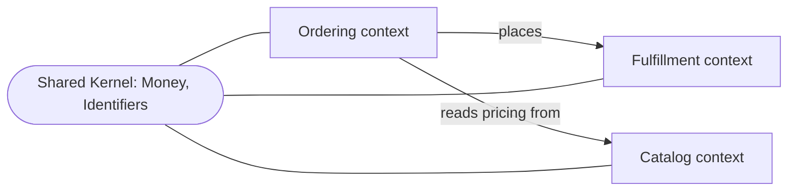
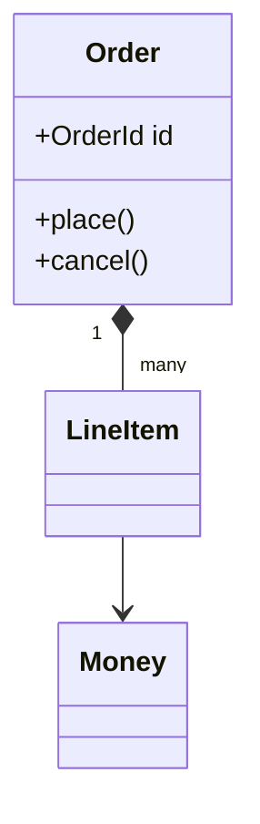
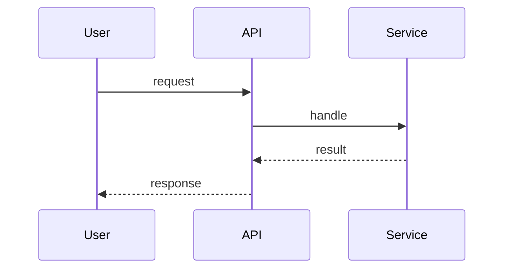
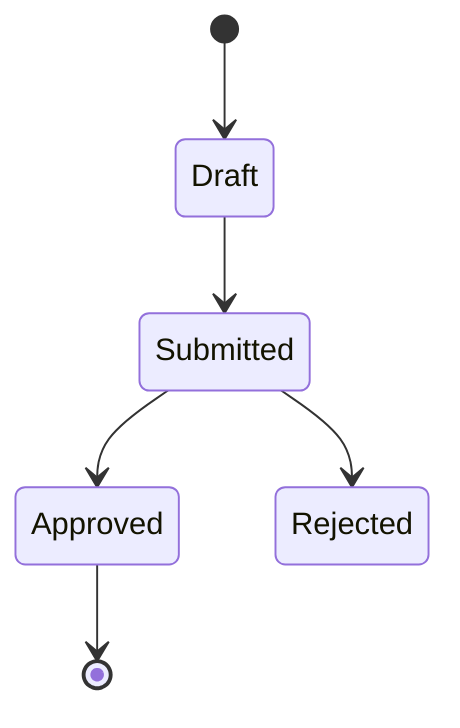
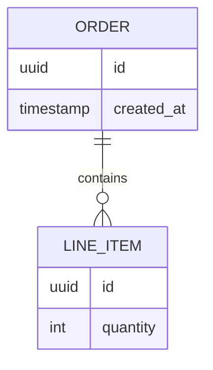
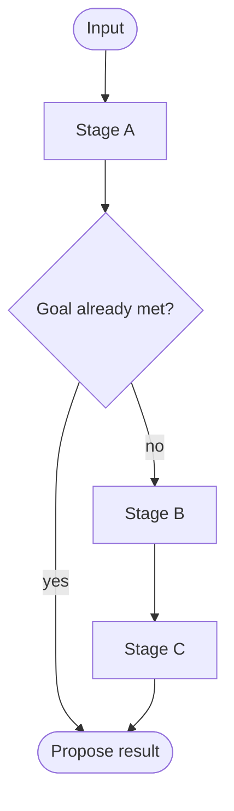

# Charts guide

One chart per domain (bounded context), system, or feature, stored in `docs/charts/` as `.md` files with fenced ` ```mermaid ` blocks (these render directly on GitHub). Embed the most relevant chart inline in the document it supports; keep the standalone file as the source of truth and keep both in sync with the prose.

Choose the type by what you are conveying. Worked examples follow.

## Context map — bounded contexts and their relationships

Use `flowchart`/`graph`. Show contexts as nodes and relationships as edges; label a Shared Kernel where contexts genuinely overlap.



## Domain model within a context

Use `classDiagram` for aggregates, entities, and value objects.



## Cross-component flow / use case

Use `sequenceDiagram`.



## Lifecycle / state machine

Use `stateDiagram-v2`.



## Persistence / data model

Use `erDiagram`.



## Pipeline / decision logic — show real branches

Use `flowchart`, and **draw the short-circuits**. If a stage can satisfy the goal and exit early, the chart must show that exit. Do not draw a straight line through stages that can actually branch (principle 3).


